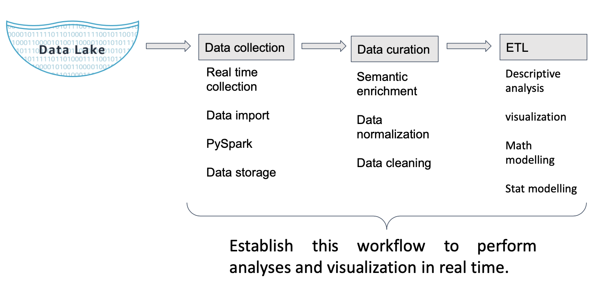

# Data Lake for the Platform for analytical models in epidemiology (PAMEpi)

## Table of contents
* [General info](#general-info)
* [Installation](#installation)
* [Dependencies](#dependencies)
* [References](#references)

## General info
This directory contributes to developing the big data architecture of  PAMEpi.  The work produced here aims to grab all data related to infectious diseases analysed in the platform. Among them are data over a range of individual infectious status, socio-economic and human behaviour. 

We integrate health and social-economic determinants data that are available for each of the 5570 Brazilian cities. Additionally, we jointly assess information about the implemented interventions and social mobility patterns. The harmonised data at the municipal level will be a foundational resource enabling the application/development of statistical analysis, nonlinear mathematical modelling, computational modelling, data visualisation and scientific dissemination about the infectious diseases that mainly affect Brazil. 

At the moment, we are focusing on the studies of the COVID-19 pandemic in Brazil. The studies are part of the  Grand Challenges ICODA COVID-19 Data Science (2021-2022), supported by the Bill and Melinda Gates Foundation and Minderoo Foundation with HDR UK reference number 2021.0097, and the Fiocruz Innovation Promotion Program - INOVA-FIOCRUZ (2020-2021), Innovative ideas and products for the COVID-19 with reference number VPPIS-005-FIO-20-2-40.

The directory has Data collection, Data curation and Data formatting folders, representing the process applied to the datasets used. Additionally, we also include the Data Description folder to process necessary analysis to enrich our datasets. Finally, inside each folder, we specify the disease we are working on. 

*Big data workflow scheme.*

# Installation

Currently the library is on production, so the easiest way to use is clone our repository or copy the functions available in this directory. 

# Dependencies

Models were implemented using Python > 3.5 and depend on libraries such as [Pandas](https://github.com/pandas-dev/pandas), [SciPy](https://github.com/scipy/scipy), [Numpy](https://github.com/numpy/numpy), [Matplotlib](https://github.com/matplotlib/matplotlib), etc. For the full list of dependencies as well libraries versions check requirements.txt.
 
# License

[MIT License](LICENSE.txt)

## References 

